# Plugin gestionmsg

gestionmsg est un plugin **Jeedom** qui permet de gérer les destinataires et messages associés.

# Configuration du plugin
Après avoir installé le plugin, il vous suffit de l’activer. Ce plugin n’a aucune configuration particulière :

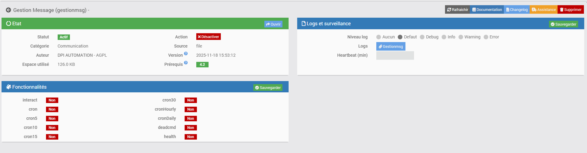

# Configuration des équipements
La configuration des équipements gestionmsg est accessible à partir du menu plugin :

# Page d'Accueil

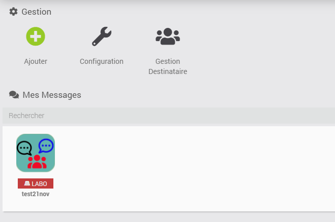

* **Ajouter** : permet d'ajouter un équipement
* **Configuration** : permet d'accéder à la configuration du PLUGIN
* **Gestion Destinataire** : permet de gérer les destinataires (nom, e-mail, tel...)

***
## Gestion des destinataires

Depuis cette fenêtre, on peut gérer les destinataires:
* **Ajouter** : ajout d'un destinataire
* **Ajouter Users Jeedom** : ajout des utilisateurs Jeedom configurés dans la section *Réglages->Système->Utilisateurs*
 1. leur numero de téléphone et e-mail sont renseignés **uniquement** si les plugins *mail et sms* sont installés et qu'une commande portant le nom du User est configurée sinon il faut le renseigner manuellement.
 2. si un destinataire porte le nom d'un User Jeedom alors les champs tel et mail sont remplacés si vide.
* **SynchroJeedom** : permet de synchroniser les destinataires du plugin gestionmsg avec les users Jeedom et les plugins de type communication (*mail et sms*).
 1. Si le destinataire n'existe pas dans les Users alors un User du nom du destinataire sera créé (il sera non actif, et sans droits).
 2. Si une commande porte le nom du destinataire dans les plugins de type communication alors les numeros de telephone et e-mail seront mis à jour.
* **Supprimer**: permet de supprimer en meme temps les destinataires selectionnés 

**LE PLUGIN AJOUTE OU MET A JOUR JEEDOM OU LES AUTRES PLUGINS MAIS NE SUPPRIME PAS DES COMMANDES.**

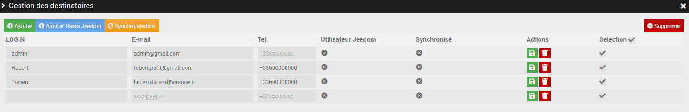

* **LOGIN** : renseigner le nom du destinataire.
* **E-mail** : renseigner l'e-mail du destinataire.
* **Tel.** : renseigner le numero de telephone du destinataire au format +33xxxxxxxxx.
* **Utilisateur Jeedom** : indique si le destinataire est un User Jeedom.
* **Synchronisé** : indique si il y a eu une SynchroJeedom (la date et heure s'affichent).
* **Actions** : Sauvegarder ou Supprimer destinataire.
* **Selection** : si cochée alors tous les destinataires sont selectionnés. (pour par exemple supprimer plusieurs destinataires en meme temps).
                
***
## Ajouter un équipement gestionmsg

Même principe que pour tous les équipements Jeedom, après avoir saisi le nom la page suivante s'affiche:

### Onglet Equipement

Cliquer pour afficher details

 
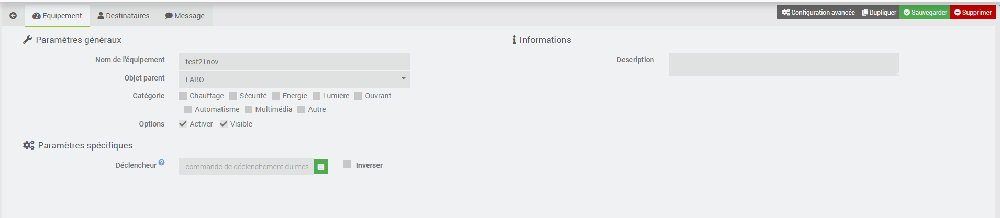

* **Nom de l’équipement** : nom de votre équipement gestionmsg
* **Objet parent** : indique l’objet parent auquel appartient l’équipement
* **Activer** : permet de rendre votre équipement actif
* **Visible** : rend votre équipement visible sur le dashboard
* **Déclencheur** : selectionner la commande de **type Info** qui déclenche l'envoi des messages actifs de l'onglet Message.

### Onglet Destinataires

Cliquer pour afficher details

Cet Onglet permet de gérer les groupes de destinataire.

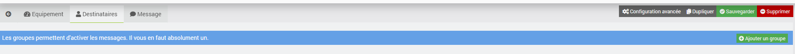

1. Cliquer sur le bouton **Ajouter un groupe**
2. La fenêtre suivante s'ouvre pour saisir le nom du nouveau groupe: ex. TEST

   
  
4. le groupe est créé: ex.TEST

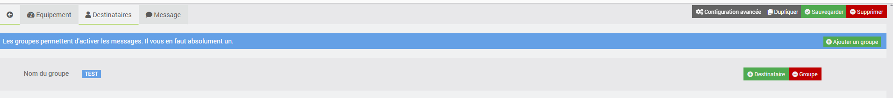   

5. Maintenant vous pouvez ajouter des destinataires au groupe en cliquant sur le bouton **Destinataire**. La page suivante s'affiche:

6. Selectionner les Destinataires et Sauvegarder. Le groupe est complété avec les destinataires selectionnés.

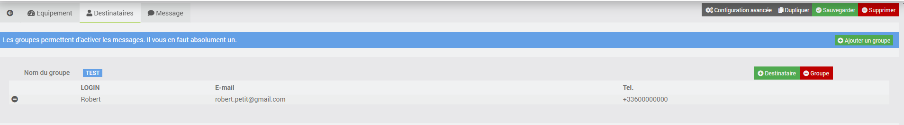

**SAUVEGARDER TOUT en cliquant sur le bouton suivant:**

### Onglet Message

Cliquer pour afficher details

 
Cet Onglet permet de gérer les messages.

1. Cliquer sur le bouton **Ajouter un type de message**
2. La fenêtre suivante s'ouvre pour saisir le nom du nouveau type de message: ex. MAIL

3.le message type est créé: ex.MAIL

4.maintenant il faut lui attribuer un groupe:

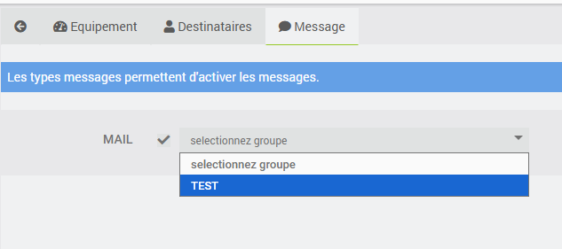

5.Attribuer une commande: ex.le plugin mail est installée avec un equipement testMail.

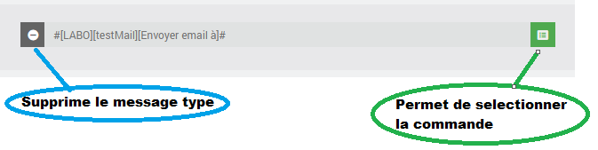

6.Saisir un message: ex.test message Mail.

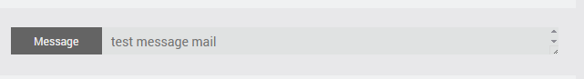

**SAUVEGARDER TOUT en cliquant sur le bouton suivant:**

# Widget du Plugin
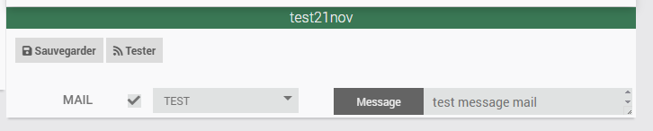

Sur le widget, on retouve le contenu de l'onglet message.

**Depuis cette interface on peut**:
* activer/desactiver l'envoi du message
* modifier le groupe
* modifier le message

**Il faut ensuite cliquer sur le bouton Sauvegarder**

**Un bouton *Tester* est present.**
Il permet de tester l'envoi des messages sans attendre le declenchement du declencheur.
